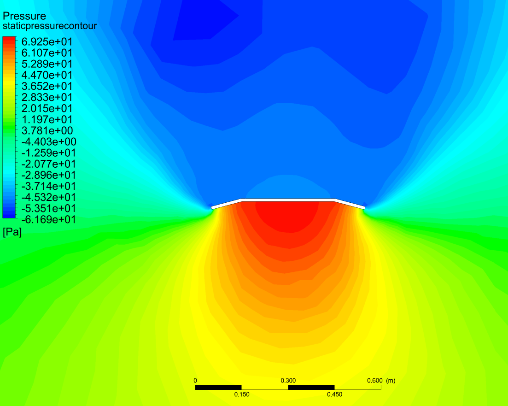

# 2d-bellyflop-aero-control
Aerodynamics and optimal control for a simplified spacecraft belly-flop landing maneuver.

### Info
Was inspired to explore belly-flop aerodynamics and optimal control while watching the recent controls tour-de-force in Boca Chica, TX ([Starship SN8's belly flop maneuver test](https://www.youtube.com/watch?v=ap-BkkrRg-o)).  For now the system is just two-dimensional, capturing the roll dynamics, but have some aero sensitivities generated from CFD and a linear-quadratic attitude tracking controller up and running.  A brief optimal-trajectory control is also explored, albeit open-loop.  At the end is a sketch for possibly building such a scale model and running hardware-in-the-loop tests, which may be fun to undertake one day.

Some detail is provided below, but see <a href = "https://github.com/rkaggarwal/2d-bellyflop-aero-control/blob/main/math/aero_dynamics_and_control.pdf" > math/aero_dynamics_and_control.pdf </a> for more information and the folders above for higher resolution images and videos.
 
 
 

### Dynamics
Using a simplified vehicle model,

the roll dynamics can be written as

Linearizing about reference equilibria gives:

 
 
 

### Linear-Quadratic Roll Reference Tracking

This formulation can be used in a roll-tracking linear-quadratic control (LQR), which solves the following optimization problem for a feedback control law u = -K*q:

In closed-loop, the vehicle tracks step roll angle references (air stream velocity is 10 m/s along +Y):

.
 
 
 

### Trajectory Optimization

And for exploration, tried out a control with a minimal-cost trajectory for pin-point landing (albeit open-loop, not in a MPC-like receding horizon).

The dynamics expands to a larger state which captures inertial (X, Y) position (note this is still quite simplified):

Solving for a cost-minimal trajectory gives the following state and control evolution going from (X, Y) = (100 m, 100 m) to the origin:

.
 
 
 

### Aerodynamic Sensitivities

In order to accurately capture the aerodynamic loads on the vehicle, a swept parameter study in CFD yields the net forces (Fx, Fy) and moment (Mz) on the body as a function of body roll angle (phi), left flap angle (theta1), and right flap angle (theta2).  The air stream velocity was kept constant at 10 m/s in the Inertial +Y direction, but loads can be approximated by a square-law for higher or lower velocities.

A summary of sensitivities is below, where each row is a particular load case (Fx, Fy or Mz), and each column has the extremes of the body roll angles (phi = -45 deg, 0 deg, 45 deg).  Colorbars are consistent row-wise, to better illustrate the strength of 2nd order trends (e.g. saddle points).

Hand calcs show decent agreement for the simple case of a rectangular plate perpendicular to the flow (phi = theta1 = theta2 = 0 deg):
1/2 * rho_air * C_d * A * v^2 = 1/2 * 1.225 kg/m^3 * 2.0 * .50 m^2/m of depth * 10.^2 (m/s)^2 = 60. N of drag, where CFD predicts ~50 N.

Some interesting configurations are shown below for body roll (phi) = 0:

(Max Fx configuration)
 
 
 

(Max Fy configuration, note the slight cupping into the flow)
 
 
 

(Max Mz configuration)
 
 
 

### Build Sketch

This could be fun to build one day, using a scale model and a box fan for load:

With a pin joint near the center of gravity of the vehicle and a body-mounted IMU, attitude controllers could be tested to track and hold certain body roll (phi) angles.  With the addition of a load cell on the support post, the aero loads can be propagated in a separate non-linear 2D environment that virtually moves the (X, Y) coordinates of the vehicle -- and these coordinates could be 'spoofed' into the on-board controller feedback that targets a virtual pin-point landing (the controllers think its actions have consequences in the (X, Y) domain, but in reality its center of gravity is fixed).  Additionally, controller and modeling robustness could be tested by injecting arfiticial disturbances, actuator saturations, model mismatches, etc. into the non-linear simulation to see how the system behaves with real hardware-in-the-loop.
